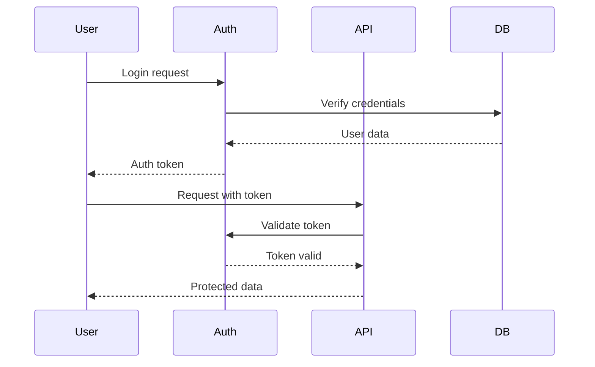

# {{PROJECT_NAME}} - System Map

> Complete system overview and architecture visualization for {{PROJECT_NAME}}

## 🏗️ System Architecture

```mermaid
graph TB
    subgraph "User Interface"
        UI[{{UI_COMPONENT}}]
    end
    
    subgraph "Application Layer"
        API[{{API_LAYER}}]
        SVC[{{SERVICE_LAYER}}]
    end
    
    subgraph "Data Layer"
        DB[{{DATABASE_TYPE}}]
        CACHE[{{CACHE_SYSTEM}}]
    end
    
    subgraph "External Services"
        EXT1[{{EXTERNAL_SERVICE_1}}]
        EXT2[{{EXTERNAL_SERVICE_2}}]
    end
    
    UI --> API
    API --> SVC
    SVC --> DB
    SVC --> CACHE
    SVC --> EXT1
    SVC --> EXT2
```

## 📊 Component Overview

### Core Components
{{#each CORE_COMPONENTS}}
#### {{name}}
- **Purpose**: {{purpose}}
- **Technology**: {{technology}}
- **Dependencies**: {{dependencies}}
- **APIs**: {{apis}}
{{/each}}

### Data Flow
{{#each DATA_FLOWS}}
1. **{{source}}** → **{{target}}**
   - Method: {{method}}
   - Format: {{format}}
   - Frequency: {{frequency}}
{{/each}}

## 🔌 Integration Points

### Internal APIs
{{#each INTERNAL_APIS}}
- **{{endpoint}}**: {{description}}
  - Method: {{method}}
  - Authentication: {{auth}}
  - Rate Limit: {{rate_limit}}
{{/each}}

### External Integrations
{{#each EXTERNAL_INTEGRATIONS}}
- **{{service}}**: {{description}}
  - API: {{api_endpoint}}
  - Purpose: {{purpose}}
  - Data Format: {{data_format}}
{{/each}}

## 🗂️ Module Structure

```
{{PROJECT_NAME}}/
├── {{MODULE_1_DIR}}/          # {{MODULE_1_PURPOSE}}
│   ├── {{MODULE_1_MAIN}}
│   ├── {{MODULE_1_COMPONENTS}}
│   └── {{MODULE_1_TESTS}}
├── {{MODULE_2_DIR}}/          # {{MODULE_2_PURPOSE}}
│   ├── {{MODULE_2_MAIN}}
│   ├── {{MODULE_2_COMPONENTS}}
│   └── {{MODULE_2_TESTS}}
├── {{SHARED_DIR}}/            # Shared utilities
├── {{CONFIG_DIR}}/            # Configuration
└── {{DEPLOYMENT_DIR}}/        # Deployment configs
```

## 🔄 State Management

### Application State
- **State Manager**: {{STATE_MANAGER}}
- **State Shape**: {{STATE_SHAPE}}
- **Persistence**: {{PERSISTENCE_STRATEGY}}

### Data Models
{{#each DATA_MODELS}}
#### {{name}}
```{{MODEL_LANGUAGE}}
{{model_definition}}
```
- Relationships: {{relationships}}
- Validation: {{validation}}
{{/each}}

## 🔐 Security Architecture

### Authentication Flow


### Security Layers
{{#each SECURITY_LAYERS}}
- **{{layer}}**: {{description}}
  - Implementation: {{implementation}}
  - Controls: {{controls}}
{{/each}}

## 📈 Performance Architecture

### Caching Strategy
- **Level 1**: {{CACHE_LEVEL_1}}
- **Level 2**: {{CACHE_LEVEL_2}}
- **Level 3**: {{CACHE_LEVEL_3}}

### Scaling Patterns
{{#each SCALING_PATTERNS}}
- **{{pattern}}**: {{description}}
  - When to use: {{when_to_use}}
  - Implementation: {{implementation}}
{{/each}}

## 🚀 Deployment Architecture

### Environments
{{#each ENVIRONMENTS}}
#### {{name}}
- **Purpose**: {{purpose}}
- **Configuration**: {{configuration}}
- **Resources**: {{resources}}
- **URL**: {{url}}
{{/each}}

### Infrastructure
```yaml
# infrastructure.yml
{{INFRASTRUCTURE_CONFIG}}
```

## 📊 Monitoring & Observability

### Metrics Collection
- **Application Metrics**: {{APP_METRICS}}
- **Infrastructure Metrics**: {{INFRA_METRICS}}
- **Business Metrics**: {{BUSINESS_METRICS}}

### Logging Architecture
```
┌─────────────┐    ┌─────────────┐    ┌─────────────┐
│   App Logs  │───▶│ Log Aggregator│───▶│   SIEM      │
└─────────────┘    └─────────────┘    └─────────────┘
       │                   │                   │
       ▼                   ▼                   ▼
┌─────────────┐    ┌─────────────┐    ┌─────────────┐
│   Debug     │    │   Analysis  │    │   Alerts   │
└─────────────┘    └─────────────┘    └─────────────┘
```

## 🔧 Development Architecture

### Build System
```bash
# Build pipeline
{{BUILD_PIPELINE_STEPS}}
```

### Testing Architecture
- **Unit Tests**: {{UNIT_TEST_FRAMEWORK}}
- **Integration Tests**: {{INTEGRATION_TEST_FRAMEWORK}}
- **E2E Tests**: {{E2E_TEST_FRAMEWORK}}

## 📚 Related Documentation

- [CONTEXT.md](CONTEXT.md) - Design philosophy
- [WORKFLOW.md](WORKFLOW.md) - System workflows
- [docs/ARCHITECTURE.md](docs/ARCHITECTURE.md) - Detailed architecture
- [EVALS.md](EVALS.md) - Testing strategy

---

## 🔄 Evolution History

| Version | Date | Changes |
|---------|------|---------|
| {{CURRENT_VERSION}} | {{CURRENT_DATE}} | {{CURRENT_CHANGES}} |
| {{PREVIOUS_VERSION}} | {{PREVIOUS_DATE}} | {{PREVIOUS_CHANGES}} |

---

**Last Updated**: {{LAST_UPDATED_DATE}}  
**Architecture Version**: {{ARCH_VERSION}}

---

*This system map provides a high-level overview of {{PROJECT_NAME}}'s architecture. For detailed implementation information, refer to the specific module documentation.*
