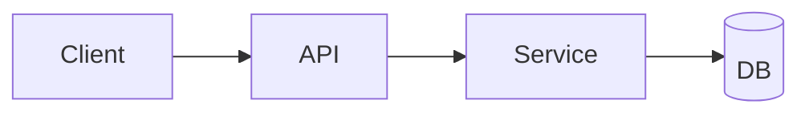

# docs/ARCHITECTURE.md

**Purpose**: System architecture, module boundaries, and key design decisions.
**Last Updated**: {{LAST_UPDATED_DATE}}

## Architecture Overview

## Folder / Module Structure

## Data Flow

## Key Decisions

## Non-Goals / Constraints

## Diagrams

