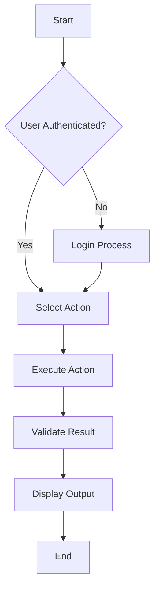

# {{PROJECT_NAME}} - Workflow Guide

> Complete guide to user workflows, processes, and validation in {{PROJECT_NAME}}

## 🎯 Overview

This document describes all major workflows in {{PROJECT_NAME}}, including user interactions, data flows, and validation processes.

## 📋 Workflow Categories

### User Workflows
{{#each USER_WORKFLOWS}}
#### {{name}}
- **Purpose**: {{purpose}}
- **Prerequisites**: {{prerequisites}}
- **Steps**: 
  {{#each steps}}
  {{@index}}. {{this}}
  {{/each}}
- **Expected Outcome**: {{outcome}}
- **Validation**: {{validation}}

{{/each}}

### Administrative Workflows
{{#each ADMIN_WORKFLOWS}}
#### {{name}}
- **Purpose**: {{purpose}}
- **Required Permissions**: {{permissions}}
- **Steps**:
  {{#each steps}}
  {{@index}}. {{this}}
  {{/each}}
- **Audit Requirements**: {{audit}}

{{/each}}

### Data Processing Workflows
{{#each DATA_WORKFLOWS}}
#### {{name}}
- **Input**: {{input}}
- **Processing Steps**:
  {{#each processing}}
  - {{this}}
  {{/each}}
- **Output**: {{output}}
- **Error Handling**: {{error_handling}}

{{/each}}

## 🔄 Detailed Workflow Examples

### Primary User Workflow


#### Step-by-Step Instructions
1. **Initialization**
   - Check user permissions
   - Load user preferences
   - Initialize session

2. **Action Selection**
   - Present available options
   - Validate user choice
   - Check prerequisites

3. **Execution**
   - Perform requested action
   - Handle errors gracefully
   - Log activity

4. **Validation**
   - Verify completion
   - Check data integrity
   - Update status

5. **Completion**
   - Present results
   - Clean up resources
   - Update history

## ✅ Validation Rules

### Input Validation
{{#each VALIDATION_RULES}}
- **{{type}}**: {{rule}}
{{/each}}

### Process Validation
- All workflows must have clear start/end points
- Error states must be handled explicitly
- Success criteria must be measurable
- Audit trails must be maintained

### Output Validation
- Results must match expected format
- Data integrity must be verified
- Performance metrics must meet thresholds

## 🚨 Error Handling

### Common Error Scenarios
{{#each ERROR_SCENARIOS}}
#### {{scenario}}
- **Symptoms**: {{symptoms}}
- **Causes**: {{causes}}
- **Resolution**: {{resolution}}
- **Prevention**: {{prevention}}

{{/each}}

### Error Recovery Process
1. Detect error condition
2. Log error details
3. Attempt automatic recovery
4. Notify user if needed
5. Document for analysis

## 📊 Performance Metrics

### Workflow Performance
| Workflow | Average Time | Success Rate | Last Updated |
|----------|--------------|--------------|--------------|
| {{#each PERFORMANCE_METRICS}}
| {{name}} | {{time}} | {{success_rate}} | {{updated}} |
{{/each}}

### Optimization Targets
- Response time < {{RESPONSE_TIME_TARGET}}ms
- Success rate > {{SUCCESS_RATE_TARGET}}%
- Error rate < {{ERROR_RATE_TARGET}}%

## 🔧 Workflow Customization

### Adding New Workflows
1. Define purpose and scope
2. Map out steps and decisions
3. Identify validation points
4. Create documentation
5. Test thoroughly
6. Deploy with monitoring

### Modifying Existing Workflows
1. Analyze impact
2. Update documentation
3. Test changes
4. Communicate updates
5. Monitor performance

## 📝 Workflow Templates

### Basic Template
```markdown
#### Workflow Name
- **Purpose**: [Clear statement of purpose]
- **Actors**: [Who performs this workflow]
- **Triggers**: [What initiates the workflow]
- **Steps**:
  1. [Step 1]
  2. [Step 2]
  3. [Step 3]
- **Success Criteria**: [How to know it succeeded]
- **Error Handling**: [What happens on failure]
```

### Complex Template
```markdown
#### Complex Workflow Name
- **Purpose**: [Detailed purpose statement]
- **Dependencies**: [Required systems/data]
- **Preconditions**: [What must be true before starting]
- **Main Flow**:
  - [Detailed step-by-step process]
- **Alternative Flows**:
  - [Alternative paths and conditions]
- **Exception Handling**:
  - [Error conditions and recovery]
- **Post-conditions**: [State after completion]
```

## 🔄 Continuous Improvement

### Monitoring
- Track workflow performance
- Collect user feedback
- Analyze error patterns
- Measure success metrics

### Optimization
- Identify bottlenecks
- Streamline processes
- Automate where possible
- Improve user experience

### Documentation Updates
- Keep workflows current
- Add new examples
- Update validation rules
- Refresh performance metrics

## 📚 Related Documentation

- [README.md](README.md) - Basic usage instructions
- [EVALS.md](EVALS.md) - Testing and evaluation
- [CONTEXT.md](CONTEXT.md) - Design decisions
- [CHANGELOG.md](CHANGELOG.md) - Recent workflow changes

---

## 📋 Workflow Checklist

### Before Implementation
- [ ] Purpose clearly defined
- [ ] All steps identified
- [ ] Error conditions considered
- [ ] Validation points defined
- [ ] Success criteria established

### During Implementation
- [ ] Following documented steps
- [ ] Handling errors appropriately
- [ ] Logging important events
- [ ] Validating at checkpoints
- [ ] Maintaining performance

### After Implementation
- [ ] Review workflow effectiveness
- [ ] Update documentation
- [ ] Collect user feedback
- [ ] Monitor performance
- [ ] Plan improvements

---

**Last Updated**: {{LAST_UPDATED_DATE}}  
**Maintainer**: {{MAINTAINER_NAME}}  
**Review Frequency**: {{REVIEW_FREQUENCY}}

---

*This workflow guide should be consulted when implementing new features or modifying existing processes in {{PROJECT_NAME}}.*
