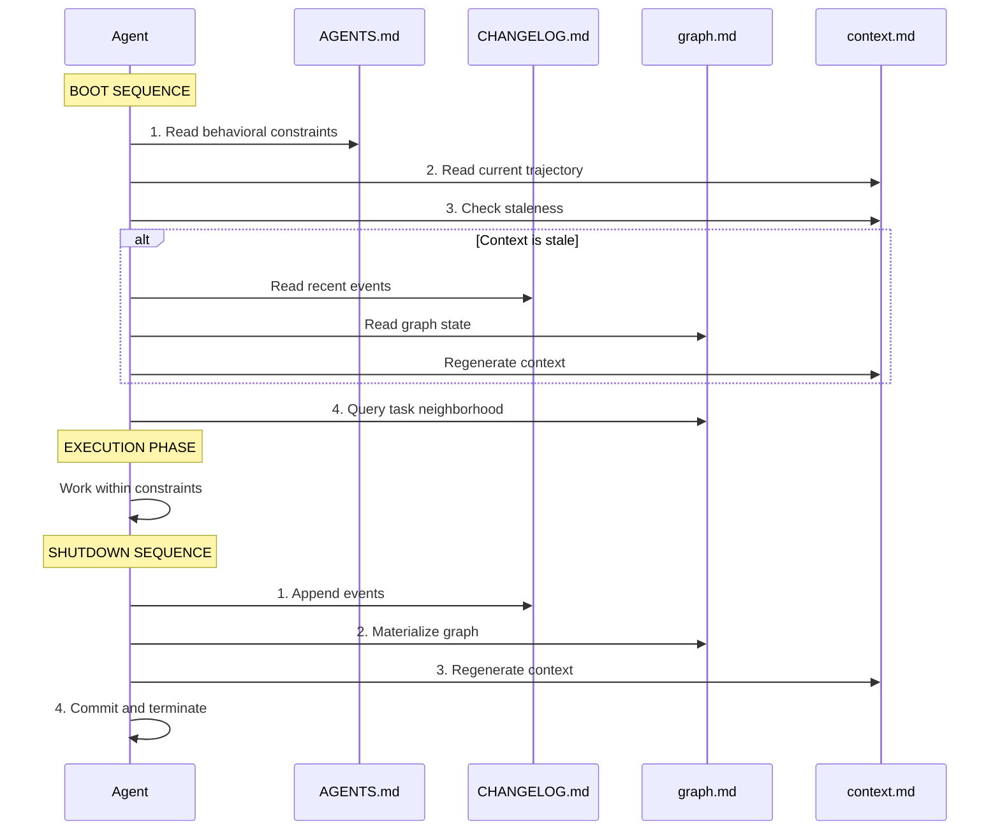
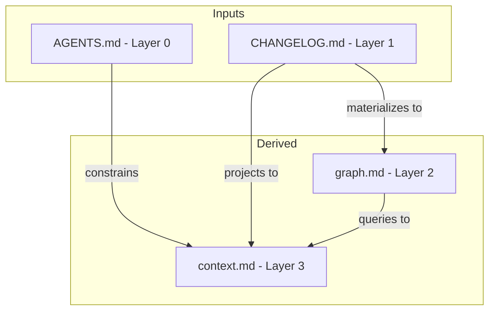
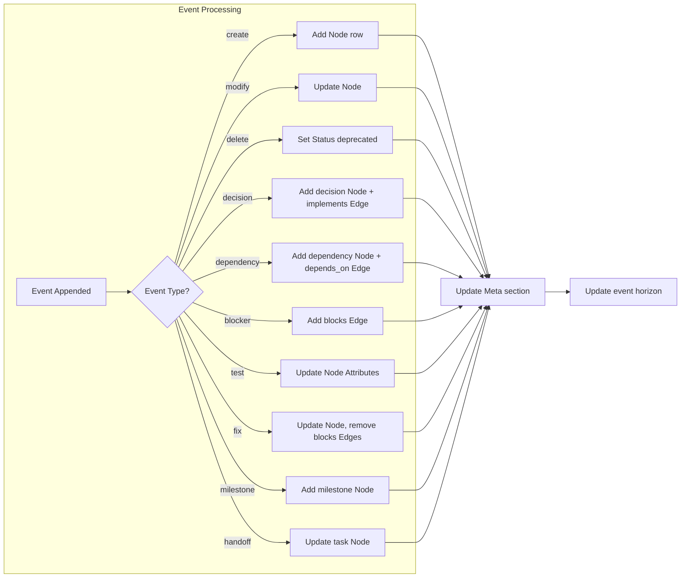

# Memory System Architecture Audit

**Document Version**: 1.0.0  
**Audit Date**: 2026-02-27  
**Scope**: Core protocol documentation and implementation gap analysis

---

## Table of Contents

1. [Executive Summary](#1-executive-summary)
2. [Architecture Overview](#2-architecture-overview)
3. [Layer Interactions](#3-layer-interactions)
4. [Data Flow Analysis](#4-data-flow-analysis)
5. [Implementation Gaps](#5-implementation-gaps)
6. [Recommendations](#6-recommendations)

---

## 1. Executive Summary

The Memory System is a **4-layer event-sourced architecture** designed for local AI agent cognition using pure markdown files. This audit documents the core protocol and identifies gaps between the specification and current implementation.

### Key Findings

| Finding | Status |
|---------|--------|
| Core protocol well-documented | ✅ Complete |
| Layer interaction patterns defined | ✅ Complete |
| Template files provided | ✅ Complete |
| Worked example available | ✅ Complete |
| Directory naming standardized on `.memory/` | ✅ Resolved |
| Validation script added | ✅ Complete |
| Initialization script added | ✅ Complete |

---

## 2. Architecture Overview

### 2.1 Four-Layer Model

```
┌─────────────────────────────────────────────────────────┐
│  Layer 3: NARRATIVE (context.md)                        │
│  Derived projection — "what matters right now"          │
│  Ephemeral. Rebuilt from Layer 1 + Layer 2.             │
├─────────────────────────────────────────────────────────┤
│  Layer 2: KNOWLEDGE GRAPH (graph.md)                    │
│  Materialized view — entities, relations, states        │
│  Queryable. Updated only by materialization from L1.    │
├─────────────────────────────────────────────────────────┤
│  Layer 1: EVENT LOG (CHANGELOG.md)                      │
│  Source of truth — every decision, change, result       │
│  Append-only. Immutable once committed.                 │
├─────────────────────────────────────────────────────────┤
│  Layer 0: BEHAVIORAL CORE (AGENTS.md)                   │
│  Constitution — rules, constraints, Three Pillars       │
│  Immutable during execution. Read at boot only.         │
└─────────────────────────────────────────────────────────┘
```

### 2.2 Design Principles

| Principle | Description |
|-----------|-------------|
| Memory is infrastructure | Agents read files, no internal state |
| Append-only truth | Events never edited once committed |
| One-way data flow | L1 → L2 → L3, never backward |
| Stateless agents | Boot from files, execute, write, die |
| Git is the database | Commits are transactions |
| Pure markdown | No JSON, no tooling, no runtime |

### 2.3 File Locations

| Layer | File | Location |
|-------|------|----------|
| L0 | `AGENTS.md` | Project root |
| L1 | `CHANGELOG.md` | Project root |
| L1E | `TODO.md` | Project root (Full tier) |
| L2 | `graph.md` | `.memory/` directory |
| L3 | `context.md` | `.memory/` directory |

---

## 3. Layer Interactions

### 3.1 Agent Lifecycle Sequence



### 3.2 Layer Dependencies



### 3.3 Data Flow Rules

| From | To | Operation | Trigger |
|------|----|-----------|---------|
| Agent | L1 | Append | After any action |
| L1 | L2 | Materialize | After event append |
| L1 + L2 | L3 | Regenerate | Session start or staleness |
| L0 | Agent | Read | Boot only |

### 3.4 Trust Hierarchy

When layers conflict, resolve by trust order:

```
L0 (AGENTS.md)    → Highest authority — behavioral rules always win
L1 (CHANGELOG.md) → Source of truth for all facts
L2 (graph.md)     → Must match L1 — if not, rematerialize
L3 (context.md)   → Must match L1+L2 — if not, regenerate
```

---

## 4. Data Flow Analysis

### 4.1 Event to Graph Materialization



### 4.2 Context Regeneration Algorithm

```
1. READ graph.md
   → List all nodes with Status = active OR blocked

2. READ CHANGELOG.md
   → Get last 20 events OR last 48 hours (whichever is more)

3. FILL each section mechanically:
   - Active Mission: From most recent milestone/decision events
   - Current Sprint: Graph nodes where Type = task, Status = active
   - Active Constraints: Recent decision events
   - Blockers: Graph blocks edges where target is active
   - Recent Changes: Events chronological, newest first
   - Key Dependencies: Graph depends_on edges for active components
   - Next Actions: Active tasks minus blockers, respecting precedes

4. UPDATE Event horizon comment
```

### 4.3 Staleness Detection

```
COMPARE:
  context.md Event horizon (e.g., evt-045)
  CHANGELOG.md last event ID (e.g., evt-050)

RESULT:
  Match   → Fresh, use directly
  Mismatch → Stale, regenerate
  Missing → Generate from scratch
```

---

## 5. Implementation Gaps

### 5.1 Gap Analysis Matrix

| Component | Specified | Implemented | Gap |
|-----------|-----------|-------------|-----|
| L0: AGENTS.md | ✅ | ✅ | None |
| L1: CHANGELOG.md template | ✅ | ✅ | None |
| L2: graph.md template | ✅ | ✅ | None |
| L3: context.md template | ✅ | ✅ | None |
| Deployment directory | ✅ | ✅ | Standard: `.memory/` at project root |
| Worked example | ✅ | ✅ | None |
| Skill definition (memory-system-setup) | ✅ | ✅ | None |
| config.json | ✅ | ✅ | None |
| Templates directory | ✅ | ✅ | None |
| Validation script | ✅ | ✅ | `memory-system/scripts/validate-memory.py` |
| Initialization script | ✅ | ✅ | `memory-system/scripts/initialize-memory.py` |

### 5.2 Gap Details

#### G1/G2: Directory Naming — Resolved

**Resolution**: The specification and protocol use **`.memory/`** at the target project root for derived views (graph.md, context.md). There is no `.active-memory/` directory in the specification; the audit previously referenced a naming inconsistency that has been resolved by standardizing all documentation on `.memory/` as the deployment location.

- **Module structure**: `memory-system/` in the repo contains templates, skill, docs, and scripts.
- **Deployment structure**: Target projects get `CHANGELOG.md` at root and `.memory/graph.md`, `.memory/context.md` when using Core/Full tier.

#### G3: Validation and Initialization Scripts — Resolved

**Implementation**:
- **Validation**: `memory-system/scripts/validate-memory.py` — validates L0 (AGENTS.md), L1 (CHANGELOG.md format and events), L2 (graph.md sections and consistency), L3 (context.md staleness). Run from project root: `python memory-system/scripts/validate-memory.py [--project-root PATH]`.
- **Initialization**: `memory-system/scripts/initialize-memory.py` — creates CHANGELOG.md and optional .memory/ files and TODO.md by tier. Run from project root: `python memory-system/scripts/initialize-memory.py <project_name> [mvp|core|full] [--project-root PATH]`.

See `docs/VALIDATION-SCRIPT.md` and `docs/INITIALIZATION-SCRIPT.md` for full reference.

#### G4: Template Variable Inconsistency — Resolved

**Resolution**: `memory-system/scripts/initialize-memory.py` performs variable substitution for `{{PROJECT_NAME}}`, `{{DATE}}`, `{{TIER}}`, and other placeholders when initializing Core/Full tiers. Manual copy-from-template remains documented in the skill for environments where the script is not run.

### 5.3 Documentation Gaps

| Document | Missing Content |
|----------|-----------------|
| [`memory-system/README.md`](../README.md) | Deployment and script usage documented |
| [`memory-system/memory-system-setup/SKILL.md`](../memory-system-setup/SKILL.md) | memory-system-setup skill; troubleshooting in skill |
| [`docs/protocols/MEMORY-SYSTEM-PROTOCOL.md`](../../docs/protocols/MEMORY-SYSTEM-PROTOCOL.md) | No versioning strategy for protocol changes |

---

## 6. Recommendations

### 6.1 High Priority

#### R1: Clarify Directory Structure

Update [`memory-system/README.md`](../README.md) to clearly distinguish:
- **Module structure**: What's in the `memory-system/` directory
- **Deployment structure**: What gets deployed to target projects

**Suggested structure**:
```
memory-system/                    # MODULE (this repo)
├── README.md                     # Module documentation
├── SKILL.md                      # Skill definition
├── config.json                   # Skill configuration
├── templates/                    # Templates to deploy
│   ├── changelog.md.tpl.md      # Deploys as CHANGELOG.md
│   ├── graph.md.tpl.md          # Deploys as .memory/graph.md
│   └── context.md.tpl.md        # Deploys as .memory/context.md
└── _examples/                    # Usage examples

target-project/                   # DEPLOYED STRUCTURE
├── AGENTS.md                     # Layer 0
├── CHANGELOG.md                  # Layer 1
├── TODO.md                       # Layer 1 Extension
└── .memory/                      # Derived views
    ├── graph.md                  # Layer 2
    └── context.md                # Layer 3
```

#### R2: Add Basic Validation Script

Create `memory-system/scripts/validate-memory.py`:

```python
#!/usr/bin/env python3
"""Validate memory system files for consistency."""

import re
import sys
from pathlib import Path

def validate_changelog(path: Path) -> list[str]:
    """Validate CHANGELOG.md format and integrity."""
    errors = []
    content = path.read_text()
    
    # Check for Event Log section
    if "## Event Log" not in content:
        errors.append("Missing '## Event Log' section")
    
    # Extract and validate events
    events = re.findall(r'### (evt-\d+)', content)
    if events:
        # Check sequential IDs
        numbers = [int(e.split('-')[1]) for e in events]
        expected = list(range(1, max(numbers) + 1))
        if numbers != expected:
            errors.append(f"Non-sequential event IDs: {numbers}")
    
    return errors

def validate_graph(path: Path) -> list[str]:
    """Validate graph.md consistency."""
    errors = []
    content = path.read_text()
    
    # Check for required sections
    for section in ["## Nodes", "## Edges", "## Meta"]:
        if section not in content:
            errors.append(f"Missing '{section}' section")
    
    return errors

def main():
    project_root = Path.cwd()
    errors = []
    
    # Validate Layer 1
    changelog = project_root / "CHANGELOG.md"
    if changelog.exists():
        errors.extend(validate_changelog(changelog))
    else:
        errors.append("CHANGELOG.md not found")
    
    # Validate Layer 2
    graph = project_root / ".memory" / "graph.md"
    if graph.exists():
        errors.extend(validate_graph(graph))
    
    if errors:
        print("Validation errors:")
        for e in errors:
            print(f"  - {e}")
        sys.exit(1)
    else:
        print("✓ Memory system validation passed")
        sys.exit(0)

if __name__ == "__main__":
    main()
```

### 6.2 Medium Priority

#### R3: Add Template Processor

Create `memory-system/scripts/initialize-memory.py`:

```python
#!/usr/bin/env python3
"""Initialize memory system files for a new project."""

from pathlib import Path
from datetime import datetime

def initialize(project_name: str, tier: str = "mvp"):
    """Initialize memory system for a project."""
    template_dir = Path(__file__).parent.parent / "templates"
    project_root = Path.cwd()
    
    # Layer 1: CHANGELOG.md
    changelog_template = template_dir.parent / "changelog.md"
    changelog_content = changelog_template.read_text()
    changelog_content = changelog_content.replace("YYYY-MM-DD", datetime.now().strftime("%Y-%m-%d"))
    (project_root / "CHANGELOG.md").write_text(changelog_content)
    
    if tier in ("core", "full"):
        # Layer 2 & 3: .memory/
        memory_dir = project_root / ".memory"
        memory_dir.mkdir(exist_ok=True)
        
        for template_name, output_name in [("graph.md.tpl.md", "graph.md"), ("context.md.tpl.md", "context.md")]:
            template = template_dir / template_name
            content = template.read_text()
            content = content.replace("{{PROJECT_NAME}}", project_name)
            content = content.replace("{{DATE}}", datetime.now().strftime("%Y-%m-%d"))
            content = content.replace("{{TIER}}", tier)
            (memory_dir / output_name).write_text(content)
    
    print(f"✓ Initialized {tier} tier memory system for {project_name}")

if __name__ == "__main__":
    import sys
    project_name = sys.argv[1] if len(sys.argv) > 1 else "my-project"
    tier = sys.argv[2] if len(sys.argv) > 2 else "mvp"
    initialize(project_name, tier)
```

#### R4: Document Tier Deployment

Add to [`memory-system/README.md`](../README.md):

```markdown
## Deployment by Tier

### MVP Tier
```bash
cp memory-system/changelog.md CHANGELOG.md
```

### Core Tier
```bash
cp memory-system/changelog.md CHANGELOG.md
mkdir -p .memory
cp memory-system/templates/context.md.tpl.md .memory/context.md
```

### Full Tier
```bash
cp memory-system/changelog.md CHANGELOG.md
mkdir -p .memory
cp memory-system/templates/graph.md.tpl.md .memory/graph.md
cp memory-system/templates/context.md.tpl.md .memory/context.md
touch TODO.md
```
```

### 6.3 Low Priority

#### R5: Version the Protocol

Add to [`docs/protocols/MEMORY-SYSTEM-PROTOCOL.md`](../../docs/protocols/MEMORY-SYSTEM-PROTOCOL.md):

```markdown
## Protocol Versioning

| Version | Date | Changes |
|---------|------|---------|
| 1.0.0 | 2025-02-10 | Initial protocol definition |
| 1.1.0 | 2025-XX-XX | Added handoff payload specifications |

### Compatibility Promise

- Major version changes may break backward compatibility
- Minor version changes add features, maintain compatibility
- Patch versions fix errors without changing semantics
```

---

## Appendix: File Reference

| File | Purpose | Status |
|------|---------|--------|
| [`memory-system/README.md`](../README.md) | Module and deployment documentation | ✅ |
| [`memory-system/memory-system-setup/SKILL.md`](../memory-system-setup/SKILL.md) | Skill definition (memory-system-setup) | ✅ |
| [`memory-system/memory-system-setup/config.json`](../memory-system-setup/config.json) | Skill configuration | ✅ |
| [`memory-system/templates/changelog.md`](../templates/changelog.md) | Event log template | ✅ |
| [`memory-system/templates/graph.md`](../templates/graph.md) | Graph template | ✅ |
| [`memory-system/templates/context.md`](../templates/context.md) | Context template | ✅ |
| [`memory-system/templates/graph.md.tpl.md`](../templates/graph.md.tpl.md) | Graph template with variables | ✅ |
| [`memory-system/templates/context.md.tpl.md`](../templates/context.md.tpl.md) | Context template with variables | ✅ |
| [`memory-system/scripts/validate-memory.py`](../scripts/validate-memory.py) | Validation script | ✅ |
| [`memory-system/scripts/initialize-memory.py`](../scripts/initialize-memory.py) | Initialization script | ✅ |
| [`memory-system/_examples/worked-example.md`](../_examples/worked-example.md) | Complete walkthrough | ✅ |
| [`docs/protocols/MEMORY-SYSTEM-PROTOCOL.md`](../../docs/protocols/MEMORY-SYSTEM-PROTOCOL.md) | Full protocol | ✅ |

---

**Document Status**: Complete  
**Next Review**: 2026-03-27
