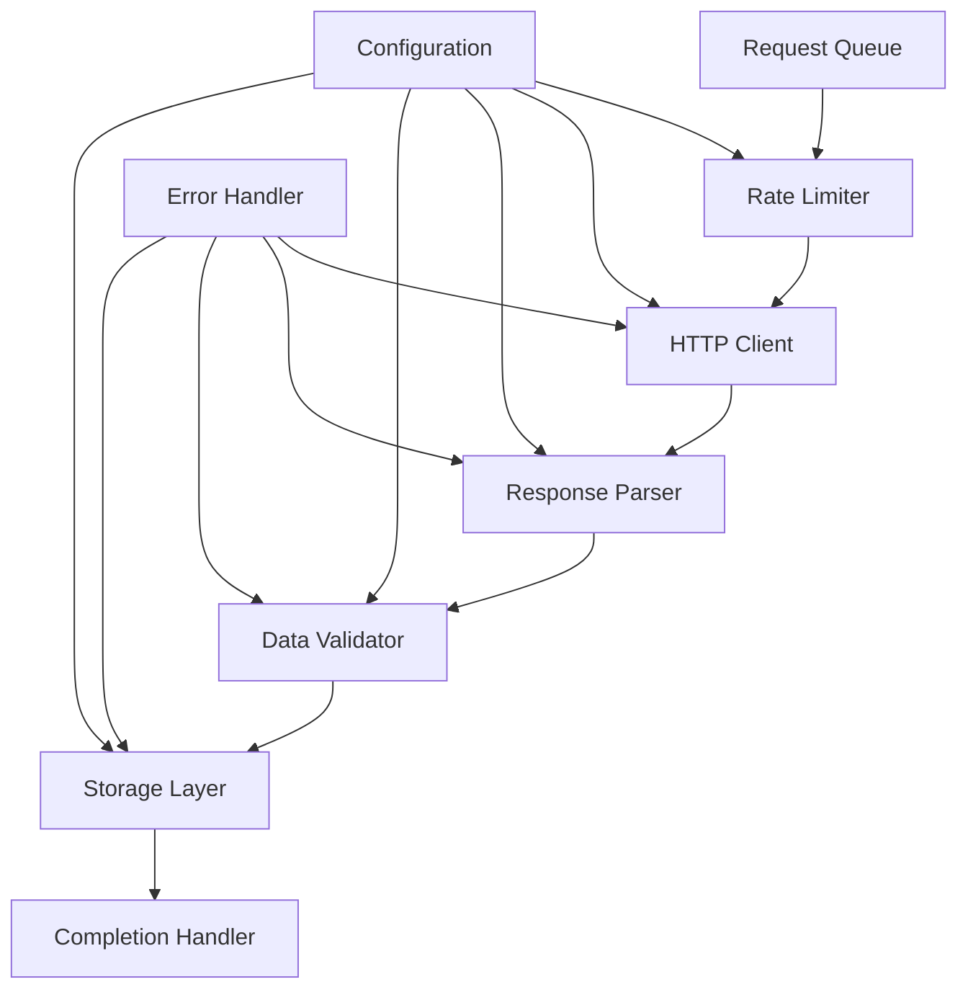

<!--
File: PIPELINE-SKELETON.tpl.md
Purpose: Template for web-scraping implementation
Template Version: 1.0
-->

# Web Scraping Pipeline Skeleton

This document describes the language-agnostic structure and patterns for implementing web scraping functionality.

## Core Pipeline Architecture



## Essential Components

### 1. Request Manager
**Purpose**: Manages the lifecycle of scraping requests

**Interface**:
```typescript
interface RequestManager {
  enqueue(url: string, options: ScrapingOptions): Promise<RequestID>
  dequeue(): Promise<ScrapingRequest | null>
  markComplete(requestId: RequestID, result: ScrapingResult): void
  markFailed(requestId: RequestID, error: ScrapingError): void
}

interface ScrapingOptions {
  priority?: number
  retryAttempts?: number
  timeout?: number
  headers?: Record<string, string>
  selectors?: Record<string, string>
}
```

**Key Responsibilities**:
- Queue management with priority handling
- Request deduplication
- Retry logic and error recovery
- Request lifecycle tracking

### 2. Rate Limiter
**Purpose**: Enforces politeness policies and prevents overwhelming target servers

**Interface**:
```typescript
interface RateLimiter {
  canMakeRequest(domain: string): Promise<boolean>
  waitForSlot(domain: string): Promise<void>
  recordRequest(domain: string): void
  getDomainStats(domain: string): DomainStats
}

interface DomainStats {
  requestsPerSecond: number
  lastRequestTime: Date
  totalRequests: number
  errorRate: number
}
```

**Key Responsibilities**:
- Domain-specific rate limiting
- Robots.txt compliance checking
- Adaptive rate adjustment based on response patterns
- Burst management

### 3. HTTP Client Wrapper
**Purpose**: Handles HTTP requests with proper error handling and retry logic

**Interface**:
```typescript
interface HTTPClient {
  fetch(url: string, options: RequestOptions): Promise<HTTPResponse>
  setProxy(proxy: ProxyConfig): void
  setUserAgent(userAgent: string): void
  getStats(): ClientStats
}

interface RequestOptions {
  method?: 'GET' | 'POST'
  headers?: Record<string, string>
  timeout?: number
  followRedirects?: boolean
}

interface HTTPResponse {
  status: number
  headers: Record<string, string>
  body: string | Buffer
  url: string
  responseTime: number
}
```

**Key Responsibilities**:
- HTTP request execution
- Response handling and validation
- Proxy management
- Connection pooling and reuse

### 4. Content Parser
**Purpose**: Extracts structured data from raw content

**Interface**:
```typescript
interface ContentParser {
  parseHTML(html: string, selectors: Record<string, string>): ParsedData
  parseJSON(json: string, schema: DataSchema): ParsedData
  parseXML(xml: string, xpath: Record<string, string>): ParsedData
  validateData(data: ParsedData, rules: ValidationRules): ValidationResult
}

interface ParsedData {
  extracted: Record<string, any>
  metadata: {
    parseTime: number
    matchedSelectors: string[]
    errors: ParseError[]
  }
}
```

**Key Responsibilities**:
- HTML parsing with CSS selectors/XPath
- Data extraction and transformation
- Content validation and cleaning
- Error handling for malformed content

### 5. Storage Manager
**Purpose**: Persists scraped data with deduplication and integrity checks

**Interface**:
```typescript
interface StorageManager {
  store(data: ScrapedData): Promise<StorageResult>
  exists(hash: string): Promise<boolean>
  batchStore(data: ScrapedData[]): Promise<BatchStorageResult>
  getStats(): StorageStats
}

interface ScrapedData {
  url: string
  content: Record<string, any>
  metadata: {
    scrapedAt: Date
    contentType: string
    contentHash: string
    sourceDomain: string
  }
}
```

**Key Responsibilities**:
- Data persistence with deduplication
- Batch processing optimization
- Data integrity validation
- Storage metrics and monitoring

## Configuration Schema

```yaml
scraper:
  # Rate limiting configuration
  rate_limiting:
    default_requests_per_second: 1
    max_concurrent_requests: 5
    respect_robots_txt: true
    adaptive_rate_limiting: true
    
  # HTTP client configuration
  http:
    timeout_seconds: 30
    max_redirects: 5
    user_agent: "{{PROJECT_NAME}}-scraper/1.0"
    compression: true
    keep_alive: true
    
  # Retry and error handling
  retry:
    max_attempts: 3
    backoff_strategy: "exponential"
    initial_delay_ms: 1000
    max_delay_ms: 30000
    
  # Storage configuration
  storage:
    batch_size: 100
    deduplication: true
    compression: "gzip"
    retention_days: 365
    
  # Proxy configuration (optional)
  proxy:
    enabled: false
    rotation_strategy: "round_robin"
    proxy_list: []
    
  # Monitoring and logging
  monitoring:
    metrics_enabled: true
    log_level: "info"
    trace_requests: false
    
  # Domain-specific rules
  domain_rules:
    example.com:
      requests_per_second: 0.5
      custom_headers:
        Authorization: "Bearer token"
    another-site.com:
      requests_per_second: 2
      timeout_seconds: 60
```

## Error Handling Patterns

### 1. Categorized Error Types
```typescript
enum ScrapingErrorType {
  NETWORK_ERROR = "network_error",
  PARSE_ERROR = "parse_error", 
  VALIDATION_ERROR = "validation_error",
  RATE_LIMIT_ERROR = "rate_limit_error",
  AUTHENTICATION_ERROR = "authentication_error",
  CONFIGURATION_ERROR = "configuration_error"
}

interface ScrapingError {
  type: ScrapingErrorType
  message: string
  url: string
  timestamp: Date
  retryable: boolean
  context: Record<string, any>
}
```

### 2. Retry Strategy
- **Network errors**: Retry with exponential backoff
- **Parse errors**: Log and skip (not retryable)
- **Rate limit errors**: Wait and retry with longer delays
- **Authentication errors**: Fail immediately (requires intervention)
- **Configuration errors**: Fail immediately (requires fix)

### 3. Circuit Breaker Pattern
```typescript
interface CircuitBreaker {
  execute(request: ScrapingRequest): Promise<ScrapingResult>
  getState(): CircuitState
  reset(): void
}

enum CircuitState {
  CLOSED = "closed",    // Normal operation
  OPEN = "open",        // Failing, reject requests
  HALF_OPEN = "half_open" // Testing recovery
}
```

## Data Flow Patterns

### 1. Streaming Pipeline
```
URL → Request → Response → Parse → Validate → Store → Complete
```

### 2. Batch Processing
```
URLs → Batch → Process → Store → Commit
```

### 3. Distributed Processing
```
URL Queue → Worker Nodes → Results → Aggregator → Storage
```

## Monitoring and Metrics

### Key Metrics to Track
- **Request Metrics**: Success rate, error rate, response time
- **Performance Metrics**: Throughput, concurrency, memory usage
- **Quality Metrics**: Data completeness, validation pass rate
- **Compliance Metrics**: Rate limit adherence, robots.txt compliance

### Alerting Conditions
- Success rate drops below 95%
- Average response time exceeds threshold
- Error rate spikes for specific domains
- Storage capacity approaching limits

## Security Considerations

### 1. Input Validation
- Validate URLs before processing
- Sanitize extracted data
- Check for malicious content patterns

### 2. Rate Limiting Compliance
- Always respect robots.txt
- Implement adaptive rate limiting
- Monitor for blocking signals

### 3. Data Privacy
- Identify and handle PII appropriately
- Implement data retention policies
- Secure storage of sensitive information

## Testing Strategy

### 1. Unit Tests
- Mock HTTP responses for parser testing
- Test rate limiting algorithms
- Validate data transformation logic
- Test error handling scenarios

### 2. Integration Tests
- End-to-end scraping workflows
- Database integration testing
- Error recovery testing
- Performance benchmarking

### 3. Load Tests
- Concurrent request handling
- Memory usage under load
- Rate limiting effectiveness
- Storage throughput testing

## Stack-Specific Implementation Notes

### Python Considerations
- Use `asyncio` for concurrent operations
- Leverage `requests` + `BeautifulSoup` for simplicity
- Consider `Scrapy` for complex projects
- Use SQLAlchemy for database operations

### Go Considerations
- Use `colly` framework for scraping
- Leverage goroutines for concurrency
- Use `goquery` for HTML parsing
- Standard library for database operations

### Node.js Considerations
- Use `axios` for HTTP requests
- Leverage `cheerio` for server-side DOM
- Use `async/await` patterns
- Consider `puppeteer` for JavaScript-heavy sites

## Deployment Patterns

### 1. Single Process Deployment
- Suitable for small to medium workloads
- Simple configuration and monitoring
- Easy to debug and maintain

### 2. Multi-Process Deployment
- Better for CPU-intensive parsing
- Improved fault isolation
- Horizontal scaling capability

### 3. Distributed Deployment
- Best for large-scale operations
- Requires message queues and coordination
- Complex but highly scalable

## Best Practices

1. **Always respect robots.txt** and website terms of service
2. **Implement proper rate limiting** to avoid being blocked
3. **Use appropriate user agents** to identify your scraper
4. **Handle errors gracefully** with proper retry logic
5. **Monitor performance** and adjust parameters accordingly
6. **Validate data quality** before storage
7. **Implement proper logging** for debugging and compliance
8. **Plan for scaling** from the beginning
9. **Test thoroughly** with various website structures
10. **Document your scraping rules** and configurations
